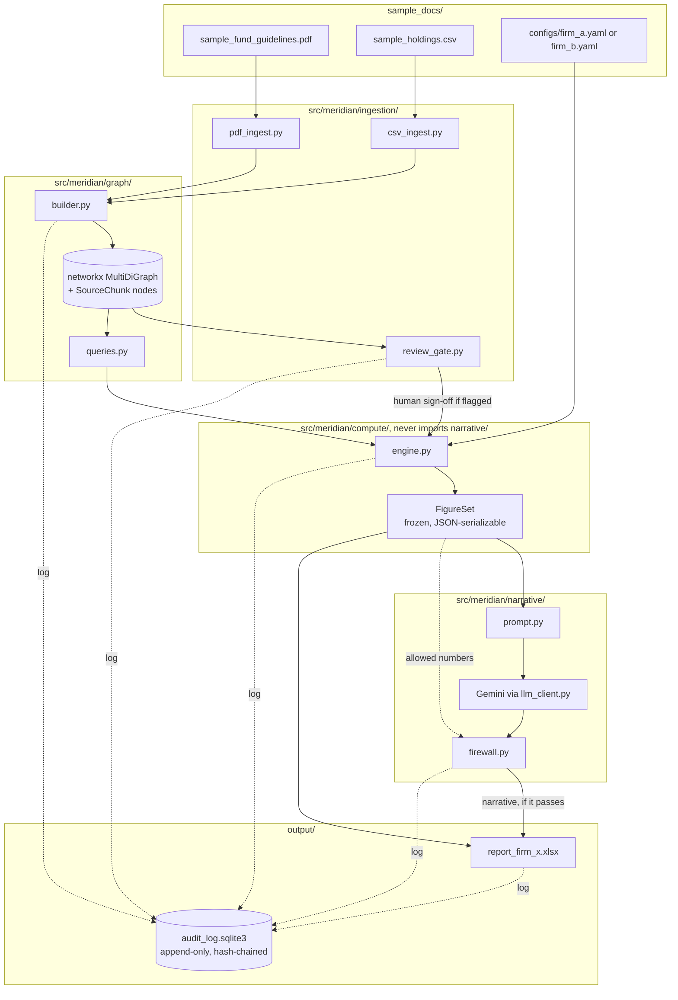

# Architecture

## Component diagram

The dotted lines into `audit_log.sqlite3` are the point: every stage that produces something an examiner
might question logs an event, independent of whether that stage's main output succeeded.

## Why the boxes are drawn where they are

**`compute/` has no arrow coming out of `narrative/`.** That's not an oversight in the diagram, it's the
actual dependency graph. `FigureSet` flows one direction, into the narrative layer, never back. This is
checked by `tests/test_module_boundaries.py`, which parses every file under `compute/` and `graph/` and
fails the build if either one ever imports anything from `narrative/` or an LLM SDK.

**The graph sits between ingestion and compute, not beside it.** Every one of the 13 figures is produced by
`compute/engine.py` calling into `graph/queries.py` to walk real edges: `positions_belonging_to`,
`asset_classes_contributing_to`, `citation_for`, and so on (`src/meridian/graph/queries.py`). None of the
compute modules read the CSV or PDF directly; they only ever see the graph. If they didn't, constraint 2
("traceable through the knowledge graph") would be true in name only.

**The config file is the only thing that changes between a Firm A run and a Firm B run.** `engine.py` takes
a `FirmConfig` object and branches on its fields (`config.non_ig_aggregate.include_fallen_angels`,
`config.concentration.gre_grouping`, `config.formatting.utilization_style`). There is no `if firm_id ==
"firm_b"` anywhere in the compute layer. `tests/test_config_switch.py` computes both firms off the exact
same graph object and asserts that only the two metrics `firm_B_brief.md` names actually change.

## Module map

| Path | Owns | Must never |
|---|---|---|
| `ingestion/` | Turning the PDF and CSV into cited facts | Aggregate across positions or compute a report figure |
| `graph/` | The networkx graph and its query helpers | Call an LLM, or write to the audit DB directly |
| `compute/` | Every number in the report, deterministically | Import `narrative/` or any LLM SDK |
| `narrative/` | Turning a `FigureSet` into 2-4 sentences of prose | Read a raw `Decimal`, the graph, or a source document |
| `audit/` | The append-only event log | Expose an UPDATE/DELETE path (the DB triggers block it even if someone tried) |
| `reporting/` | Filling `report_template.xlsx` from a `FigureSet` | Recompute or adjust a value |
| `config/` | Validating `configs/*.yaml` into a typed `FirmConfig` | Contain firm-specific logic (it's data, not code) |

## Data flow for one figure, end to end

Following `aggregate_non_ig_exposure` all the way through, for Firm A:

1. `pdf_ingest.py` extracts the sentence "Aggregate exposure to non-investment-grade instruments (High
   Yield + Structured Credit) must not exceed 20% of NAV" from page 2, tags it `chunk_id =
   sample_fund_guidelines.pdf:p2:prose:non_ig_aggregate_cap`, confidence 0.90.
2. `graph/builder.py` creates an `Aggregate:non_ig_exposure` node carrying `cap_pct = 20`, with a
   `SOURCED_FROM` edge to that chunk. It also adds `CONTRIBUTES_TO` edges from `AssetClass:high_yield` and
   `AssetClass:structured_credit` into that node.
3. `compute/aggregate.py` calls `queries.asset_classes_contributing_to(...)`, sums the market value of every
   `Position` belonging to those two asset classes (SGD 9M + SGD 6M = SGD 15M), divides by NAV (SGD 100M),
   and gets 15.0%.
4. It calls `queries.citation_for(...)` on the `Aggregate:non_ig_exposure` node, which walks its
   `SOURCED_FROM` edge to the `SourceChunk` node and reads back the exact sentence from step 1.
5. It renders `graph_path` as `(AssetClass:high_yield)-[:CONTRIBUTES_TO]->(Aggregate:non_ig_exposure)<-[:CONTRIBUTES_TO]-(AssetClass:structured_credit)`.
6. The resulting `Figure` (value `15.0%`, status `OK`, limit `max 20%`, the graph_path above, and the
   citation) is one entry in the `FigureSet` written to `output/figures_firm_a.json`.

For Firm B, step 3 additionally walks a `CONTRIBUTES_TO {basis: fallen_angel_override}` edge from
`Position:COR-05` (Marina Bay Resorts, downgraded to BB) straight into the same `Aggregate:non_ig_exposure`
node. That edge exists in the graph for both firms, but `compute/aggregate.py` only follows it when
`config.non_ig_aggregate.include_fallen_angels` is true. That's the entire mechanism behind the 15.0% to
21.0% change between the two firms' reports.
